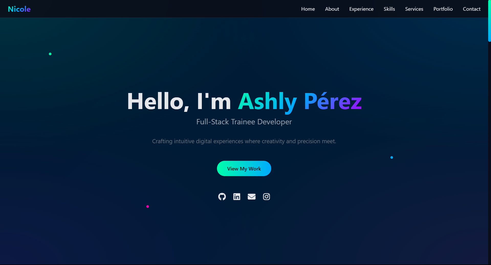
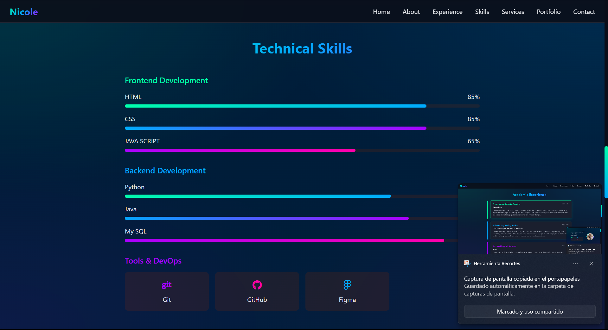
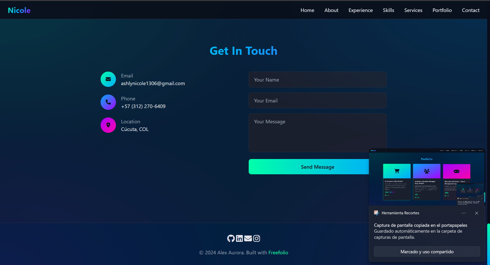

<h1 align="center">MI PORTAFOLIO DIGITAL 🌸</h1>

---

En este espacio busco muestrar mis proyectos, habilidades y experiencia como trainee en desarrollo web.

[Mi portafolio](https://portafolio-digital-ashly.vercel.app)


---

## 📌 Descripción

Este portafolio está desarrollado con HTML, CSS, TailwindCSS y JavaScript, y presenta mi perfil profesional y mis proyectos más destacados.

Incluye animaciones suaves, un diseño moderno dark-themed y optimización para dispositivos móviles.

Este portafolio fue tomado de: [https://github.com/OSSPhilippines/freefolio.git](https://github.com/OSSPhilippines/freefolio.git)

---

## 🔧 Tecnologías y herramientas


---

## 📂 Estructura del Proyecto
```
/
├── index.html
├── styles.css
├── scripts.js
├── assets/
│   └── imágenes, íconos, etc.
└── README.md
```

---

## Imagenes del portafolio









---


## Autores: 
Este portafolio fue tomado de: [https://github.com/OSSPhilippines/freefolio.git](https://github.com/OSSPhilippines/freefolio.git)
